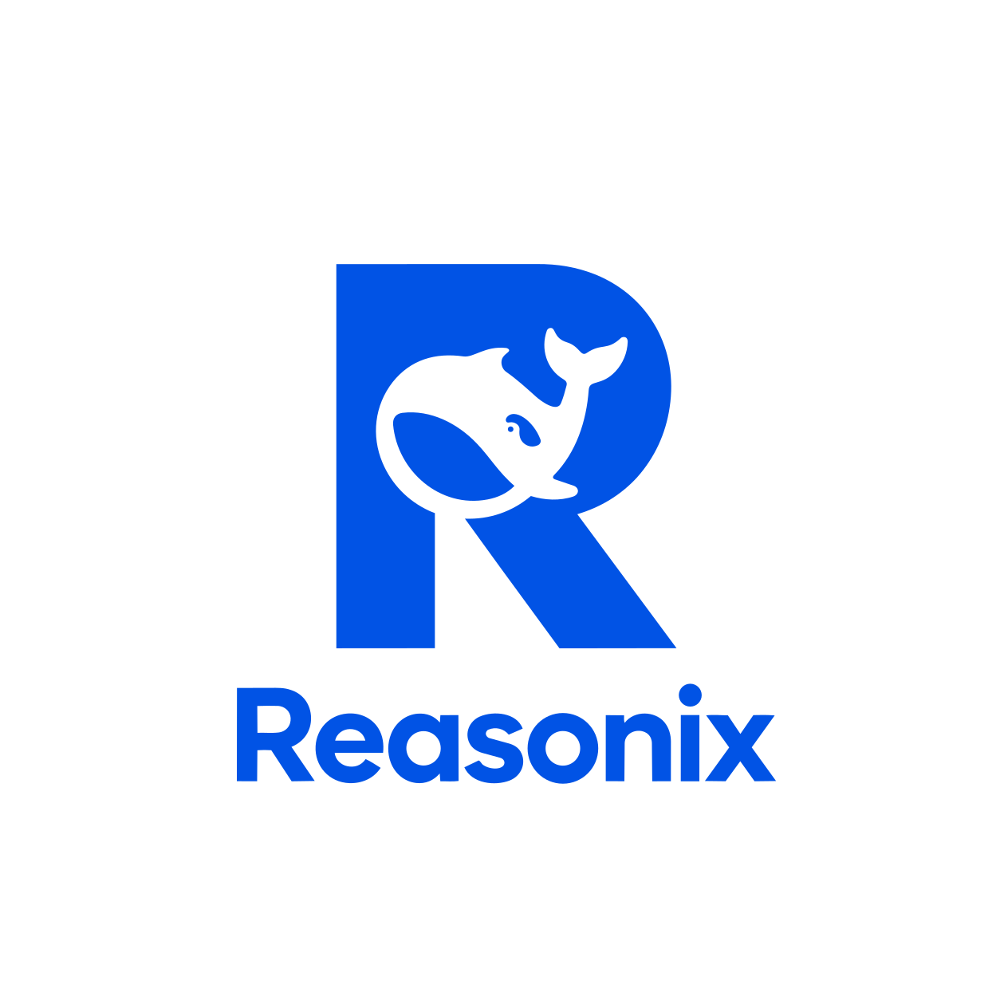

<p align="center">
  
</p>

<p align="center">
  <a href="./README.en.md">English</a>
  &nbsp;·&nbsp;
  <strong>简体中文</strong>
</p>

<p align="center">
  <a href="https://github.com/Zehee/Reasonix-Code"></a>
</p>

<p align="center">
  桌面版下载：<a href="https://github.com/Zehee/Reasonix-Code/releases/latest">Windows / macOS / Linux</a>
</p>

> **说明：** 桌面版只是一个启动壳，底层调用的是命令行版 `reasonix-code code` 的同一个 TUI / Dashboard loop。因此系统里已有命令行版时，桌面版会直接复用它、只负责弹出界面；没有时会检测 Node.js / npm 环境，缺失则提示安装，然后通过 `npm install -g reasonix-code` 自动安装命令行版。桌面安装包本身只有约 2 MB。

**Reasonix-Code** 是一个轻量、透明、可控的编程 agent，专为需要 AI 记住跨 session 决策的开发者设计——不需要向量数据库、知识图谱、黑盒式的"AI 记忆"，也不需要安装任何 MCP 服务器。

内置完整的记忆系统（`remember`、`forget`、`recall_memory`），无需任何外部依赖即可跨会话追溯决策。同时内置 49 个原生工具，覆盖文件操作、代码搜索、Shell 执行、计划管理、主题追踪等场景，开箱即用。

基于 DeepSeek-Reasonix 的 cache-first、flash-first 循环核心，我们的记忆架构从零开始为 **编程场景** 设计：确定性提炼（不用 LLM）、关键词搜索（不用 embedding）、跨 session 主题追溯（纯 JSON 文件，可读可改）。

> **状态：** 活跃开发中。基于 Reasonix TypeScript 分支（v0.x），独立演进。

---

## 问题所在

每个 coding agent 都面临同一个根本断裂：**上下文压缩和会话独立让决策碎片化。**

一个真实的例子——你花数周做一个认证模块：
- 第 1 天：决定用 JWT + httpOnly cookie（而不是 localStorage）
- 第 3 天：实现登录接口
- 第 10 天：为 Safari 兼容调整 cookie 策略
- 第 30 天：新 session 启动，Agent 竟然建议把 refresh token 放 **localStorage** —— 与 29 天前的决策直接矛盾。

每一条决策都在独立的 session 日志里，跨 session 时 Agent 看不见。这不是模型能力问题——**这是架构问题。**

Reasonix-Code 的三层记忆架构通过自动捕获、索引和关联跨 session 的决策来解决这个问题，让 Agent 在提出矛盾建议前先看到完整的时间线。

---

## 核心能力

### 三层记忆架构

专为跨 session 决策追溯设计。当你花数周做一个项目时，"为什么选 JWT 而不是 session cookie"、"Safari cookie 策略调整"等决策散落在多个 session 中。Reasonix-Code 自动捕获并串联它们。

```
┌──────────────────────────────────────────────┐
│  第一层：原始日志                              │
│  ~/.reasonix/sessions/*.jsonl                 │
│  只读审计                                     │
├──────────────────────────────────────────────┤
│  第二层：材料库                                │
│  ~/.reasonix/refined/<ws>.sqlite              │
│  ~/.reasonix/refined/<ws>/searches/*.json     │
│  ~/.reasonix/refined/<ws>/folds/*.json        │
│  确定性提炼 + 跨 session 搜索 + fold 视图      │
├──────────────────────────────────────────────┤
│  第三层：主题关联                               │
│  ~/.reasonix/themes/*.json                    │
│  跨 session 的主题时间线                        │
└──────────────────────────────────────────────┘
```

### 确定性提炼（不用 LLM）

基于关键词规则 + Markdown 结构分析。零 LLM 调用、零外部依赖。快速、可复现、可解释。

> 注意：提炼不再作为独立的渐进降噪循环运行，而是内聚到 `fold()` 和 `search_context` 中按需触发。

```json
{
  "sessionId": "abcd-...",
  "turnId": 12,
  "summary": "决定用 JWT + httpOnly cookie，不用 localStorage",
  "facts": ["JWT + httpOnly cookie 方案胜出"],
  "entities": { "files": ["src/auth/login.ts"], "tools": ["Write", "Edit"], "errors": [] }
}
```

### 搜索即打捞

`search_context "auth JWT cookie"` 命中 SQLite 索引后，自动将相邻 turn 按时间窗口聚簇（90 秒），并提炼未处理的 turn。搜索返回的结果携带 `sessionName`（当前会话名或 fold 后的归档文件名），可直接交给 `load_turns_context` 还原原文。若已从 cluster/fold view 获得骨架，可指定 `mode="material"` 只加载工具调用与工具结果，避免重复。

### 跨 session 主题追溯

```
tag_theme "auth-flow" with sessionName="..." turnId=12
trace_theme "auth-flow"
  → 按时间线展示所有相关决策
  → 即使跨越 3 周、8 个 session
```

### Cache-first 循环

继承 DeepSeek 核心优化：自动前缀缓存、flash 模型成本控制、智能上下文折叠。

---

## 安装

需要 **Node.js >= 22** 和 npm。

```bash
npm install -g reasonix-code
```

---

## 快速开始

```bash
# 首次运行：设置向导引导你配置 API Key。
# 配置完成后，进入项目目录执行：
reasonix-code              # 自动将当前目录作为工作区，进入代码模式
reasonix-code chat         # 交互式对话（无文件系统）
```

### 源码运行（需 Node.js >=22）

```bash
git clone https://github.com/Zehee/Reasonix-Code.git
cd Reasonix-Code
npm install
npm run dev code      # 代码模式
npm run dev chat      # 交互式对话
```

---

## 架构概览

```
src/
├── cli/           Commander.js + Ink TUI
├── code/          代码模式工具集装配
├── tools/         工具注册（文件系统、shell、记忆、提炼、主题）
├── refine/        对话轮次提炼引擎（确定性，不用 LLM）
├── themes/        跨 session 主题追踪
├── memory/        会话存储、项目记忆、用户记忆
├── loop/          CacheFirstLoop、调度、修复
├── mcp/           MCP 客户端 + 传输层
└── index/         导出入口
```

### 存储布局

```
~/.reasonix/
├── sessions/                      ← 所有会话
│   ├── {workspace-slug}/          ← 按工作区隔离
│   │   ├── active.jsonl           ← 当前活跃会话（尚未折叠；纯追加，无骨架/无影子）
│   │   ├── {sessionId}__archive_{ts}.jsonl  ← 已归档的原始会话（/new、clearLog、fold 触发）
│   │   ├── {sessionId}.denoised.jsonl      ← fold 时生成的降噪骨架
│   │   ├── {sessionId}.toolcache.jsonl     ← 工具结果原文缓存
│   │   └── {sessionId}.meta.json           ← 元数据
│   ├── __chat__/                  ← 无工作区会话
│   ├── {root-hash}/checkpoints/   ← 文件写入前的 git 快照
│   └── *.plan.json, *.pending.json
├── refined/{workspace-slug}/      ← 提炼索引 + 折叠视图
│   ├── refined.sqlite
│   ├── folds/*.json               ← fold 视图（决策簇、turn 引用）
│   └── searches/*.json            ← search_context 搜索视图
├── mcp-handshake/                 ← MCP 握手缓存（全局共享）
├── memory/                        ← 用户记忆 + 项目记忆
└── config.json
```

---

## 缓存策略

Reasonix-Code 的 **cache-first 循环**最大化 DeepSeek 前缀缓存命中率 —— 每次缓存命中比未命中**便宜 50 倍**（$0.0028 vs $0.14 每 1M 输入 token）。策略分为三层：

### 1. 前缀稳定性

不可变前缀（系统提示词 + 工具 schema + few-shots）通过哈希保持跨轮次字节一致。关键机制：

- **`sortToolSpecs()`** — 本地编码点排序，工具顺序永不变化
- **`canonicalizeMcpToolForCache()`** — 递归排序 JSON Schema 键，MCP 工具 schema 字节稳定
- **`_frozenToolsCache`** — 冻结工具快照，避免重复克隆
- **推理内容连续性** — 旧 `reasoning_content` 不在轮次间剥离（保持消息内容 ⇒ 缓存命中）

### 2. 单跳折叠（无渐进降噪）

**已废除渐进降噪循环。** 上下文管理只有两种状态：

- **阶段一：纯追加。** 不压缩，完整保留所有工具结果。
- **阶段二：触发 Fold。** 当上下文接近阈值时，一次性全量 denoise、聚簇、生成 fold 视图，然后以新的四层结构重新冷启动 prompt。

折叠后的主 prompt 结构：

```
<!-- fold: f-xxx -->           ← 对上一届三项的 epoch 摘要（最多保留 5 个，第 6 个时重置为最新 1 个）
...
<!-- current-fold: f-yyy -->   ← 当前 fold 标记
[Decision clusters / 相关 turn IDs]
[演化框架：最近 30 轮降噪骨架]
[热区原文：最近 5 轮完整内容]
[当前 turn]
```

| 层级 | 范围 | 内容 | 缓存角色 |
|------|------|------|----------|
| Epoch 摘要 | 更早 fold | 对上一届 clusters/framework/hotzone 的递归战略摘要（≤1024 tokens） | 长期稳定，缓存命中 |
| 决策簇 | 本次 fold | 决策事实、文件引用、turn IDs | 高稳定，缓存命中 |
| 演化框架 | 本次 fold 前 30 轮 | 用户意图、工具调用、结论 | 稳定期内缓存命中 |
| 热区原文 | 最近 5 轮 | 完整 user/assistant/tool 内容 | 每轮变化，接受 miss |

折叠是一次性跳变，不是持续渐进过程。第一次 fold 只生成 clusters/framework/hotzone，不生成 epoch 摘要；后续 fold 才调用轻量 summarizer 对上一届三项做摘要。fold 完成后原 JSONL 被归档为 `{sessionId}__archive_{ts}.jsonl`，非热区的 tool result 完整存入 `{sessionId}.toolcache.jsonl`，prompt 中替换为 `[archived: ...]` 占位符。所有被压缩的历史都可通过 `turnId` / `tool_call_id` 从归档 JSONL、`.toolcache.jsonl` 或 `fold_view.json` 中精确还原。

### 3. 错误容忍

工具调用错误被宽容处理，避免浪费轮次：

- **`lenientJsonParse()`** — 5 种修复策略（包裹花括号、去除尾逗号、单引号转双引号、去键引号）
- **`inferToolArgs()`** — 模糊参数名匹配（`path` ↔ `file` ↔ `filepath`）、函数调用风格解析、Shell KV 格式
- **`fillMissingRequiredParam()`** — 缺失 required 参数自动填充类型默认值（string → `""`，number → `0`）
- **工具结果保持完整** — tool result 与 tool_call args 在追加和轮次间不再截断，完整保留到 fold 时一次性归档到 `.toolcache.jsonl`，保证同轮内多次 API 调用的前缀缓存字节一致

### MCP 握手缓存

MCP 服务器握手结果持久化到 `~/.reasonix/mcp-handshake/`，以确定性 spec 指纹（类型、command/url、args、env、headers——排序后哈希）为键。重启时工具从缓存以相同顺序注册 —— 无需等待握手，不会前缀缓存失效。

### 基准数据

| 指标 | 无优化 | 带缓存策略 |
|--------|-------|----------|
| 输入费用（20 轮会话） | ~$0.037 | ~$0.016（**省 57%**） |
| 到达 75% 折叠阈值前的轮数 | ~166 | ~277（**+67%**） |
| 轮次切换缓存未命中 | 100%（reasoning 被剥离） | ~20%（reasoning 保留） |
| 会话恢复缓存命中 | 0%（内容被愈合改变） | ~80%（内容保持） |
| MCP 工具重启顺序 | 随机 | 确定性（缓存） |

---

## 与上游的关系

Reasonix-Code 是 [DeepSeek-Reasonix](https://github.com/esengine/DeepSeek-Reasonix)（TypeScript v0.x 分支）的一个 fork。主要区别：

- **独立方向** — 不跟随 Go 重写版本（main-v2）的路线
- **三层记忆** — 实现 RFC #5539 设计，不采用 v5 memory 模型
- **鲁棒性优先** — 自愈 session ID、冗余元数据、崩溃安全写入

---

## 许可证

MIT — 见 [LICENSE](./LICENSE)。
