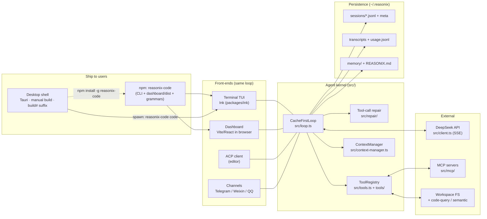
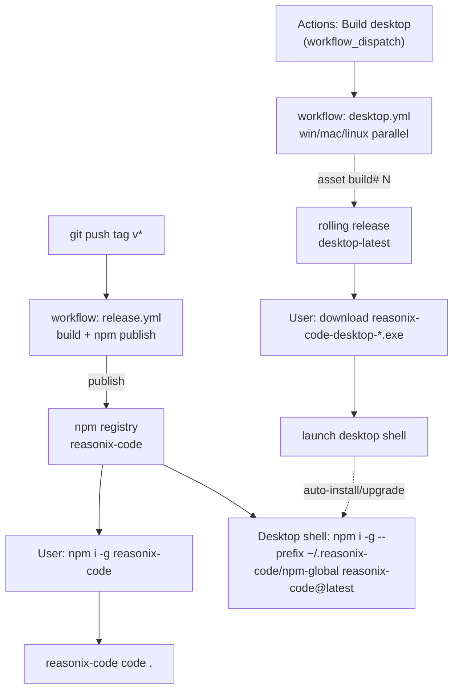
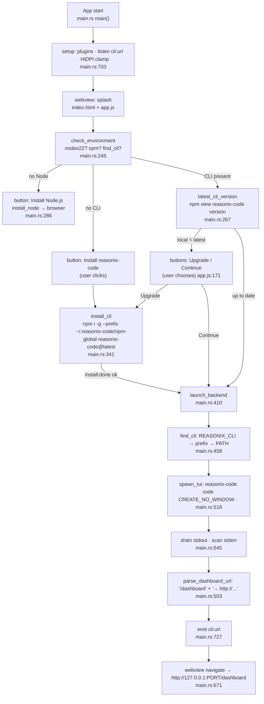
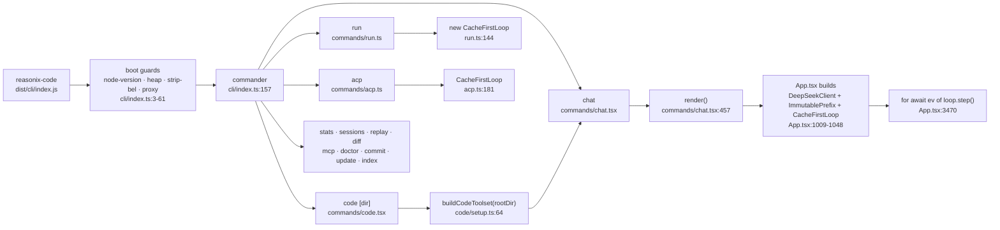
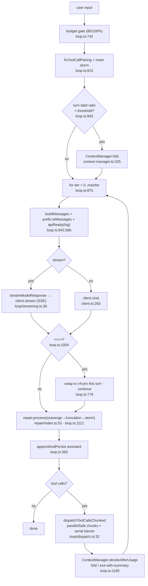
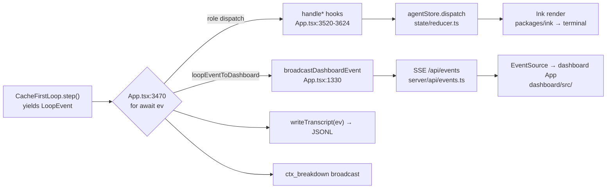
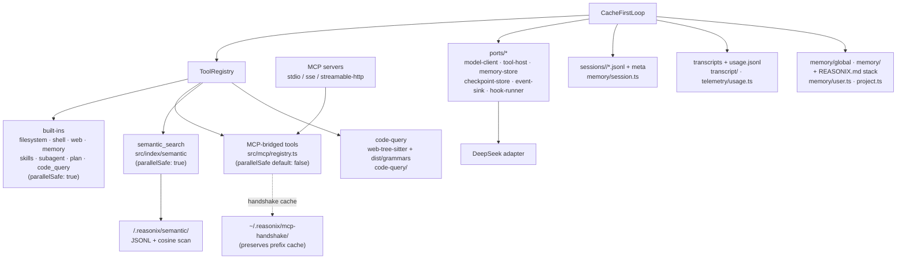

# Reasonix-Code — Flow Overview

A ground-up map of how the product is built, shipped, and run. Diagrams are
Mermaid (render on GitHub). File references point into the current tree.

This complements `ARCHITECTURE.md` (design philosophy + module layout). Here
the focus is **flow**: who calls whom, and where data goes.

---

## 1. The big picture

Reasonix-Code is one agent loop with multiple front-ends and one shipping unit
(the npm package). The desktop app is a thin native shell that installs the
same package and loads its runtime dashboard.

Key idea: **one loop, many sinks.** `CacheFirstLoop.step()` yields `LoopEvent`s
that fan out to the terminal (Ink), the browser (HTTP/SSE), ACP, and channel
bots — all reading the same underlying store.

---

## 2. Distribution & install flow

- **CLI ships via npm**, triggered by a `v*` tag (`.github/workflows/release.yml`).
  The tarball includes `dist/`, `dashboard/dist`, `dashboard/index.html`,
  `dashboard/app.css`, tree-sitter grammars (`package.json` `files:`).
- **Desktop ships separately**, only on manual trigger
  (`.github/workflows/desktop.yml`). The shell does **not** follow tags; each
  build is distinguished by a `${{ github.run_number }}` suffix and lands in the
  rolling `desktop-latest` release.
- The desktop installer is ~2 MB: it bundles **only the splash**; the real UI
  is loaded at runtime from the CLI.

---

## 3. Desktop shell runtime flow

`desktop/src-tauri/src/main.rs` + `desktop/app.js`. The shell’s only job:
detect → install/upgrade (via npm, **with a prompt**) → spawn the CLI → load
its dashboard URL in the webview.

Notes:
- Every spawned process uses `CREATE_NO_WINDOW` on Windows, so install/launch
  never pops a console (`main.rs:138,193,277,349,529`).
- The shell never bundles the dashboard; it discovers the URL the CLI prints to
  stderr and navigates there. Upgrade is **user-confirmed**, never automatic.
- `find_cli` honors `REASONIX_CLI` for developer override, then the managed
  prefix, then `PATH`.

---

## 4. CLI entry & command dispatch

The TUI boundary (`App.tsx`) is where the loop is actually constructed for
interactive use; `run` and `acp` build it inline for headless/bridge use.

---

## 5. The agent loop (one turn)

`CacheFirstLoop.step()` in `src/loop.ts`, built on the three cache regions from
`src/memory/runtime.ts`.

The three cache regions (`src/memory/runtime.ts`):

| Region | Mutability | Contents | Used by |
|---|---|---|---|
| `ImmutablePrefix` | fixed per session | system + sorted tool specs + few-shots | `buildMessages` |
| `AppendOnlyLog` | append-only (windowed + disk) | assistant/tool turns in order | persisted per session |
| `VolatileScratch` | reset each turn | R1 reasoning, transient plan | never sent upstream |

Cost controls wired into the loop: flash-first defaults (`src/config.ts:31`),
turn-end auto-compaction (`ContextManager`), `<<<NEEDS_PRO>>>` self-escalation
(`prompt-fragments.ts:12`), soft USD budget gate.

---

## 6. One loop, two sinks

The dashboard HTTP server (`src/server/index.ts`):
- `startDashboardServer` binds `127.0.0.1` on an ephemeral port with a per-boot
  token; builds `http://host:port/?token=…` (`server/index.ts:221`).
- Routes: `/` SPA, `/assets/*` (serves `dashboard/dist`, rewrites imports/CSS
  with the token), `/api/events` (SSE), `/api/*` (`server/router.ts`).
- `DashboardContext` (`server/context.ts`) is the live seam: subscribe events,
  submit prompt, abort turn, stats, modal resolvers, switch session.

The printed `→ http://127.0.0.1:…/dashboard…` line is what the desktop shell
scrapes to know where to navigate.

---

## 7. Integrations & persistence

Storage roots (all under `~/.reasonix/` unless noted):

| What | Where | Source |
|---|---|---|
| Sessions (memory) | `sessions/<slug>/*.jsonl` + `.meta.json` sidecars | `src/memory/session.ts` |
| Transcripts (receipts) | transcript JSONL | `src/transcript/` |
| Usage rollup | `usage.jsonl` (5 MB / 365-day compaction) | `src/telemetry/usage.ts` |
| User/project memory | `memory/global`, `memory/<projectHash>` | `src/memory/user.ts` |
| Project memory | `REASONIX.md → CLAUDE.md → AGENTS.md` | `src/memory/project.ts` |
| MCP handshake cache | `mcp-handshake/` | `src/mcp/handshake-cache.ts` |
| Semantic index | `<root>/.reasonix/semantic/` | `src/index/semantic/` |
| Config | `config.json` | `src/config.ts` |

---

## 8. Where things live (quick index)

| Concern | Path |
|---|---|
| Agent loop | `src/loop.ts`, `src/loop/` (streaming, dispatch, force-summary) |
| Cache regions | `src/memory/runtime.ts` |
| Repair pipeline | `src/repair/` (scavenge, flatten, truncation, storm) |
| Tools | `src/tools.ts`, `src/tools/`, `src/code/setup.ts` |
| DeepSeek client | `src/client.ts` |
| TUI | `packages/ink`, `src/cli/ui/` (App.tsx, state/, hooks/) |
| Dashboard | `dashboard/` (served by `src/server/`) |
| Desktop shell | `desktop/src-tauri/src/main.rs`, `desktop/app.js` |
| MCP / ACP | `src/mcp/`, `src/acp/` |
| Code intel | `src/code-query/`, `src/index/semantic/` |
| Persistence | `src/memory/`, `src/transcript/`, `src/telemetry/` |
| Channels | `src/telegram/`, `src/weixin/`, `src/qq/` |
| Config/env | `src/config.ts`, `src/env.ts`, `.env.example` |
| Release | `.github/workflows/release.yml` (npm, on `v*` tag) |
| Desktop release | `.github/workflows/desktop.yml` (manual, build# suffix) |

---

## Reading order for a newcomer

1. `docs/ARCHITECTURE.md` — why it is shaped this way (the four pillars).
2. This doc, §5 — the turn loop is the heart; everything else hangs off it.
3. `src/cli/index.ts` → `commands/code.tsx` → `commands/chat.tsx` — how a
   session starts.
4. `src/cli/ui/App.tsx` — where the loop meets the screen and the dashboard.
5. `desktop/src-tauri/src/main.rs` — the thinnest possible native wrapper.
