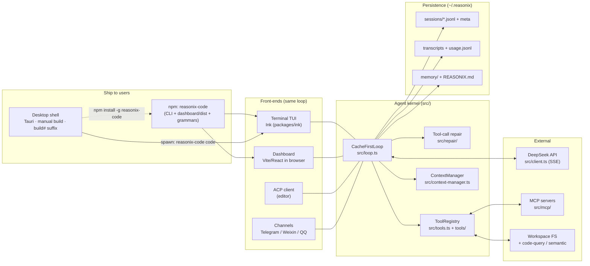
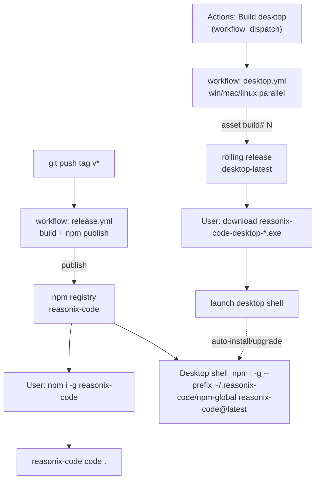
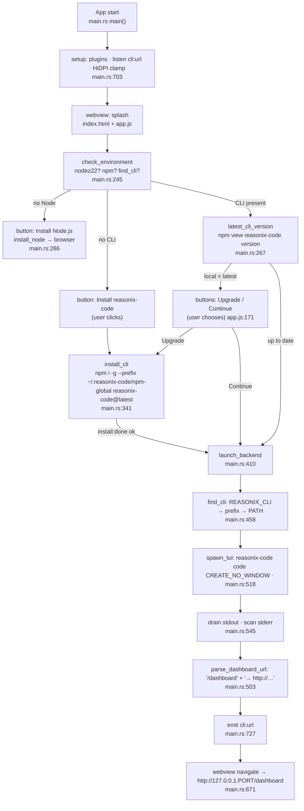
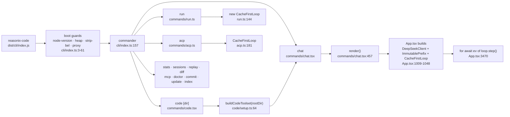
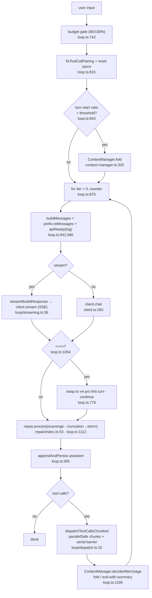
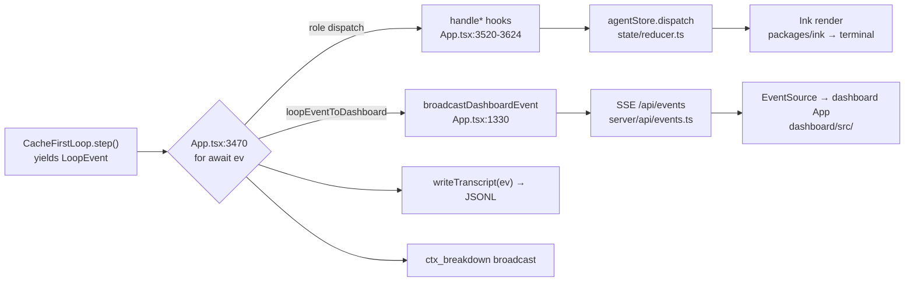
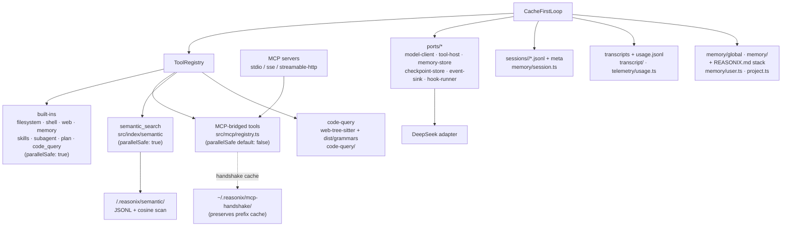

# Reasonix-Code — Flow Overview

A ground-up map of how the product is built, shipped, and run. Diagrams are
Mermaid (render on GitHub). File references point into the current tree.

This complements `ARCHITECTURE.md` (design philosophy + module layout). Here
the focus is **flow**: who calls whom, and where data goes.

---

## 1. The big picture

Reasonix-Code is one agent loop with multiple front-ends and one shipping unit
(the npm package). The desktop app is a thin native shell that installs the
same package and loads its runtime dashboard.

Key idea: **one loop, many sinks.** `CacheFirstLoop.step()` yields `LoopEvent`s
that fan out to the terminal (Ink), the browser (HTTP/SSE), ACP, and channel
bots — all reading the same underlying store.

---

## 2. Distribution & install flow

- **CLI ships via npm**, triggered by a `v*` tag (`.github/workflows/release.yml`).
  The tarball includes `dist/`, `dashboard/dist`, `dashboard/index.html`,
  `dashboard/app.css`, tree-sitter grammars (`package.json` `files:`).
- **Desktop ships separately**, only on manual trigger
  (`.github/workflows/desktop.yml`). The shell does **not** follow tags; each
  build is distinguished by a `${{ github.run_number }}` suffix and lands in the
  rolling `desktop-latest` release.
- The desktop installer is ~2 MB: it bundles **only the splash**; the real UI
  is loaded at runtime from the CLI.

---

## 3. Desktop shell runtime flow

`desktop/src-tauri/src/main.rs` + `desktop/app.js`. The shell’s only job:
detect → install/upgrade (via npm, **with a prompt**) → spawn the CLI → load
its dashboard URL in the webview.

Notes:
- Every spawned process uses `CREATE_NO_WINDOW` on Windows, so install/launch
  never pops a console (`main.rs:138,193,277,349,529`).
- The shell never bundles the dashboard; it discovers the URL the CLI prints to
  stderr and navigates there. Upgrade is **user-confirmed**, never automatic.
- `find_cli` honors `REASONIX_CLI` for developer override, then the managed
  prefix, then `PATH`.

---

## 4. CLI entry & command dispatch

The TUI boundary (`App.tsx`) is where the loop is actually constructed for
interactive use; `run` and `acp` build it inline for headless/bridge use.

---

## 5. The agent loop (one turn)

`CacheFirstLoop.step()` in `src/loop.ts`, built on the three cache regions from
`src/memory/runtime.ts`.

The three cache regions (`src/memory/runtime.ts`):

| Region | Mutability | Contents | Used by |
|---|---|---|---|
| `ImmutablePrefix` | fixed per session | system + sorted tool specs + few-shots | `buildMessages` |
| `AppendOnlyLog` | append-only (windowed + disk) | assistant/tool turns in order | persisted per session |
| `VolatileScratch` | reset each turn | R1 reasoning, transient plan | never sent upstream |

Cost controls wired into the loop: flash-first defaults (`src/config.ts:31`),
turn-end auto-compaction (`ContextManager`), `<<<NEEDS_PRO>>>` self-escalation
(`prompt-fragments.ts:12`), soft USD budget gate.

---

## 6. One loop, two sinks

The dashboard HTTP server (`src/server/index.ts`):
- `startDashboardServer` binds `127.0.0.1` on an ephemeral port with a per-boot
  token; builds `http://host:port/?token=…` (`server/index.ts:221`).
- Routes: `/` SPA, `/assets/*` (serves `dashboard/dist`, rewrites imports/CSS
  with the token), `/api/events` (SSE), `/api/*` (`server/router.ts`).
- `DashboardContext` (`server/context.ts`) is the live seam: subscribe events,
  submit prompt, abort turn, stats, modal resolvers, switch session.

The printed `→ http://127.0.0.1:…/dashboard…` line is what the desktop shell
scrapes to know where to navigate.

---

## 7. Integrations & persistence

Storage roots (all under `~/.reasonix/` unless noted):

| What | Where | Source |
|---|---|---|
| Sessions (memory) | `sessions/<slug>/*.jsonl` + `.meta.json` sidecars | `src/memory/session.ts` |
| Transcripts (receipts) | transcript JSONL | `src/transcript/` |
| Usage rollup | `usage.jsonl` (5 MB / 365-day compaction) | `src/telemetry/usage.ts` |
| User/project memory | `memory/global`, `memory/<projectHash>` | `src/memory/user.ts` |
| Project memory | `REASONIX.md → CLAUDE.md → AGENTS.md` | `src/memory/project.ts` |
| MCP handshake cache | `mcp-handshake/` | `src/mcp/handshake-cache.ts` |
| Semantic index | `<root>/.reasonix/semantic/` | `src/index/semantic/` |
| Config | `config.json` | `src/config.ts` |

---

## 8. Where things live (quick index)

| Concern | Path |
|---|---|
| Agent loop | `src/loop.ts`, `src/loop/` (streaming, dispatch, force-summary) |
| Cache regions | `src/memory/runtime.ts` |
| Repair pipeline | `src/repair/` (scavenge, flatten, truncation, storm) |
| Tools | `src/tools.ts`, `src/tools/`, `src/code/setup.ts` |
| DeepSeek client | `src/client.ts` |
| TUI | `packages/ink`, `src/cli/ui/` (App.tsx, state/, hooks/) |
| Dashboard | `dashboard/` (served by `src/server/`) |
| Desktop shell | `desktop/src-tauri/src/main.rs`, `desktop/app.js` |
| MCP / ACP | `src/mcp/`, `src/acp/` |
| Code intel | `src/code-query/`, `src/index/semantic/` |
| Persistence | `src/memory/`, `src/transcript/`, `src/telemetry/` |
| Channels | `src/telegram/`, `src/weixin/`, `src/qq/` |
| Config/env | `src/config.ts`, `src/env.ts`, `.env.example` |
| Release | `.github/workflows/release.yml` (npm, on `v*` tag) |
| Desktop release | `.github/workflows/desktop.yml` (manual, build# suffix) |

---

## 9. Dashboard HTTP API — full inventory

Served by `src/server/index.ts` on `127.0.0.1:<ephemeral>`, token-gated. Reads
accept `?token=` or `X-Reasonix-Token`; **mutations require the header**
(query token rejected — CSRF). `/api/events` (SSE) is wired in `index.ts`,
**not** in `router.ts`. `cockpit`/`hooks-events` are not endpoints — they're
embedded into `GET /api/overview` (cockpit) and `GET /api/hooks` (recentRuns).
Many "attached" endpoints return 503 in standalone mode.

**Session / turn**

| Endpoint | Method | Purpose |
|---|---|---|
| `/api/overview` | GET | Bundled snapshot: version, mode, cwd/model, edit/plan mode, pending edits, MCP/tool counts, effort, budget, stats, cockpit |
| `/api/messages` | GET | Current session transcript + `busy` |
| `/api/submit` | POST | Submit a prompt to the loop (202/409) |
| `/api/abort` | POST | Abort the current turn |
| `/api/sessions` | GET | List sessions (workspace-scoped) + current + canSwitch |
| `/api/sessions/new` | POST | Mint a fresh session |
| `/api/sessions/:name` | GET, DELETE | Read transcript / delete (refuses active) |
| `/api/sessions/:name/switch` | POST | Switch attached CLI to `:name` |
| `/api/modal` | GET | Snapshot the active modal |
| `/api/modal/resolve` | POST | Resolve active modal (shell/path/choice/plan/edit-review/checkpoint/picker/viewer) |
| `/api/loop/status` | GET | Auto-loop status |
| `/api/loop/start` | POST | Start auto-loop (`intervalMs` 5s–6h + `prompt`) |
| `/api/loop/stop` | POST | Stop auto-loop |
| `/api/plans` | GET | Archived plans + step completion ratio |
| **`/api/events`** | **GET (SSE)** | DashboardEvent stream; 25s ping; replays busy + active modal on connect |

**Tools / permissions / hooks**

| Endpoint | Method | Purpose |
|---|---|---|
| `/api/tools` | GET | Registered tool specs (name/schema/readOnly/flattened) + planMode |
| `/api/permissions` | GET, POST, DELETE | List / add / remove shell-allowlist prefixes |
| `/api/permissions/clear` | POST | Clear project allowlist (`{confirm:true}`) |
| `/api/hooks` | GET | Project + global + resolved hooks, event list, recentRuns |
| `/api/hooks/save` | POST | Write hooks block (trusts project) |
| `/api/hooks/reload` | POST | Re-apply hooks in attached session |

**Memory / skills / MCP / semantic**

| Endpoint | Method | Purpose |
|---|---|---|
| `/api/memory` | GET | List memory files |
| `/api/memory/entries` | GET | Structured entries |
| `/api/memory/read?path=` | GET | Read one entry |
| `/api/memory/:scope[/:name]` | GET, POST, DELETE | CRUD; scope = project / global / project-mem |
| `/api/skills` | GET | List skills (project/custom/global/builtin) + 7d counts |
| `/api/skills/:scope/:name` | GET, POST, DELETE | Skill CRUD (builtin read-only) |
| `/api/mcp` | GET | Live bridged servers + canHotReload/canInvoke |
| `/api/mcp/specs` | GET, POST, DELETE | Persisted MCP specs |
| `/api/mcp/reload` | POST | Hot-reload MCP bridge |
| `/api/mcp/registry` | GET | Browse marketplace (`?pages=&q=&maxPages=&limit=&refresh=`) |
| `/api/mcp/registry/install` | POST | Install marketplace server into config |
| `/api/mcp/invoke` | POST | Invoke a bridged MCP tool |
| `/api/semantic` | GET | Index + provider + job status |
| `/api/semantic/config` | GET, POST | Embedding provider config (redacted) |
| `/api/semantic/start` | POST | Start index-build job |
| `/api/semantic/stop` | POST | Abort index job |
| `/api/semantic/ollama/start` | POST | Start Ollama daemon |
| `/api/semantic/ollama/pull` | POST | Pull embedding model (async) |
| `/api/semantic/search` | POST | Run semantic search |
| `/api/index-config` | GET, POST | Read / save index exclusion config |
| `/api/index-config/preview` | POST | Dry-run walk: included/skipped counts |

**Code / files / checkpoints**

| Endpoint | Method | Purpose |
|---|---|---|
| `/api/files` | POST | @-mention picker (`{prefix}`, depth≤4) |
| `/api/files/search?q=` | GET | @-mention picker (query variant) |
| `/api/browse?path=` | GET | Directory browser (dirs only; seeds home + drives) |
| `/api/project-tree` | GET | Recursive tree (depth≤6) for attached cwd |
| `/api/git-diffs` | GET | `git diff HEAD` + staged + untracked |
| `/api/file/:path` | GET | Read workspace file (whole tail; ≤500KB; traversal-guarded) |
| `/api/file-read?path=` | GET | 12-line head + totalLines preview |
| `/api/checkpoints` | GET | List checkpoints for cwd |
| `/api/checkpoint-diffs?id=` | GET | Diff checkpoint vs working tree |
| `/api/checkpoint-restore` | POST | Restore checkpoint into working tree |
| `/api/checkpoint-create` | POST | Create checkpoint (`git ls-files` scoped) |
| `/api/checkpoint-delete` | **POST** | Delete checkpoint (uses POST, not DELETE) |
| `/api/review-diffs` | GET | Placeholder — currently `[]` |

**Settings / meta**

| Endpoint | Method | Purpose |
|---|---|---|
| `/api/health` | GET | Version + `~/.reasonix` dir sizes + usage-log bytes + job count |
| `/api/usage` | GET | Aggregated token/cost buckets |
| `/api/usage/series` | GET | Daily roll-up series |
| `/api/settings` | GET, POST | Redacted config / partial update (apiKey write-only; model/budget/effort live) |
| `/api/edit-mode` | GET, POST | review / auto / yolo / plan |
| `/api/models` | GET | Available models + current + pricing table |
| `/api/slash` | GET | Slash-command catalog (code-contextual filtered when unattached) |

---

## 10. Slash commands — full inventory

Registry `src/cli/ui/slash/commands.ts`; dispatch merges each handler file's
`handlers` map (`dispatch.ts`). Common aliases: `/?`→help · `/reset`,`/clear`→new
· `/quit`,`/q`→exit · `/retitle`→title · `/lang`→language · `/cache`→cache-miss-report
· `/tg`→telegram · `/wx`→weixin · `/sandbox`→cwd · `/se`→search-engine.
Hidden (work but not in `/help`): `/skills`, `/perms`, `/hook`.
Intercepted before dispatch: `/btw` (side question), `/resource`, `/prompt` (MCP browse).

**General / session**

| Command | Purpose |
|---|---|
| `/help` | Full grouped command reference |
| `/about` · `/keys` | Version / links · keyboard+mouse reference |
| `/new` | Fresh conversation (clears log + scrollback) |
| `/retry` | Truncate & resend last message (fresh sample) |
| `/stop` | Abort current turn (typed Esc) |
| `/btw <q>` | One-shot side question, never enters context |
| `/exit` | Quit the TUI |
| `/sessions` | List saved sessions (picker) |
| `/title` | Ask model to rename this session |
| `/session-persist [on\|off]` | Toggle resume-last-session on launch |

**Model / cost**

| Command | Purpose |
|---|---|
| `/model [id]` | Switch model (bare → picker) |
| `/effort [low\|medium\|high\|max]` | reasoning_effort cap |
| `/max-tokens [N\|off]` | Cap output tokens/turn |
| `/budget [usd\|off]` | Session USD cap (warn 80%, refuse 100%) |
| `/status` | Model, flags, context, session snapshot |
| `/cost [text]` | Last-turn spend card · with text → estimate next |
| `/context` | Context-window breakdown |
| `/stats` | Cross-session cost dashboard |
| `/cache-miss-report` | Explain recent cache misses |
| `/compact` | Fold older turns into a summary (manual) |

**Edits / history (code-mode)**

| Command | Purpose |
|---|---|
| `/apply [range]` · `/discard [range]` | Commit / drop pending edits |
| `/walk` | Step through edits git-add-p style |
| `/undo` | Roll back last applied batch |
| `/history` · `/show [id]` | List batches · dump a diff |
| `/commit "msg"` | `git add -A && git commit` |
| `/mode [review\|auto\|yolo\|plan]` | Edit-gate (bare cycles) |
| `/plan [on\|off\|strict]` | Read-only plan / strict rails |
| `/diff [summary\|full\|none]` | Diff display mode |
| `/checkpoint [list\|forget\|<name>]` | Snapshot touched files |
| `/restore [name\|id]` | Roll back to a checkpoint (bare → picker) |
| `/cwd [path]` | Switch workspace root (bare → picker) |
| `/init [force]` | Synthesize baseline REASONIX.md |
| `/jobs` · `/kill <id>` · `/logs <id> [n]` | List / stop / tail background jobs |

**Memory / skills**

| Command | Purpose |
|---|---|
| `/memory` | Dump REASONIX.md + indexes |
| `/memory list [--type X]` | List entries |
| `/memory show <name>` | Print one entry |
| `/memory forget <name>` | Delete entry |
| `/memory clear <scope> confirm` | Delete a whole scope |
| `/skill [list]` | List skills |
| `/skill show <name>` | Print one skill |
| `/skill new <name> [--global]` | Scaffold a skill |
| `/skill paths [list\|add\|remove]` | Manage custom skill paths |
| `/skill <name> [args]` | Run a skill (resubmits body) |

**MCP / integrations**

| Command | Purpose |
|---|---|
| `/mcp` | Open MCP hub (Live / Marketplace) |
| `/mcp text` | Printed-card dump (replay/non-TTY) |
| `/mcp enable\|disable <name>` | Toggle a server |
| `/mcp reconnect <name>` | Reconnect + register new tools |
| `/resource [uri]` · `/prompt [name]` | Browse + read MCP resources / prompts |

**Channels**

| Command | Purpose |
|---|---|
| `/telegram connect\|status\|disconnect` | Telegram channel |
| `/weixin connect\|status\|disconnect` | Weixin channel |
| `/qq connect\|status\|disconnect` | QQ channel |

**Admin / observability**

| Command | Purpose |
|---|---|
| `/doctor` | Health check (api/config/reach/index/hooks/project) |
| `/hooks [reload]` | List hooks · reload from disk |
| `/permissions [list]` | Show shell allowlist |
| `/permissions add\|remove\|clear [--global]` | Manage allowlist |
| `/search-engine <engine> [<key\|endpoint>]` | Switch web backend |
| `/dashboard [stop\|copy\|reset-token]` | Launch / manage embedded dashboard |
| `/loop <interval> <prompt>` · `stop` | Auto-resubmit prompt on a timer |
| `/plans` · `/plans done <id\|all>` | List / complete plan steps |
| `/replay [N]` | Load archived plan as Time-Travel snapshot |
| `/feedback` · `/update` | Open issue w/ diagnostics · version + upgrade cmd |

---

## Reading order for a newcomer

1. `docs/ARCHITECTURE.md` — why it is shaped this way (the four pillars).
2. This doc, §5 — the turn loop is the heart; everything else hangs off it.
3. `src/cli/index.ts` → `commands/code.tsx` → `commands/chat.tsx` — how a
   session starts.
4. `src/cli/ui/App.tsx` — where the loop meets the screen and the dashboard.
5. `desktop/src-tauri/src/main.rs` — the thinnest possible native wrapper.
