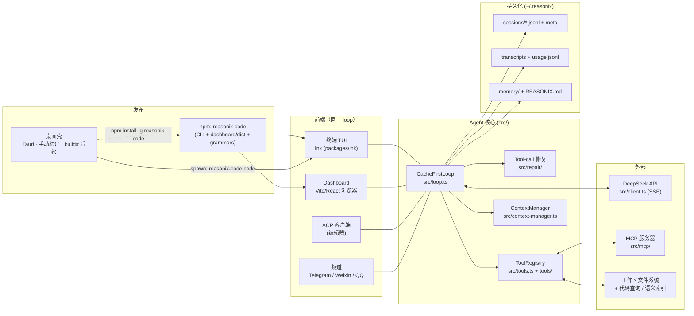
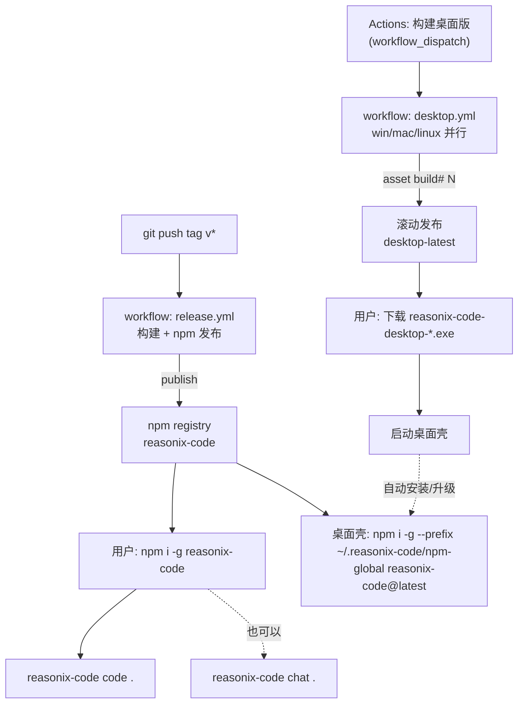
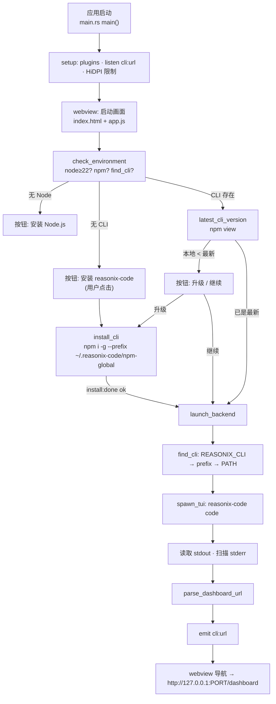
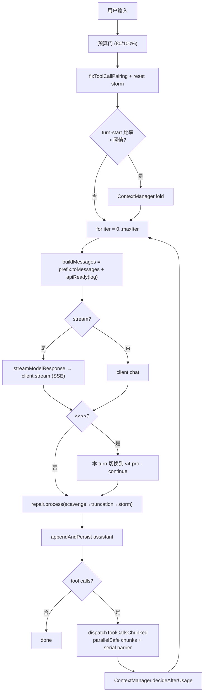
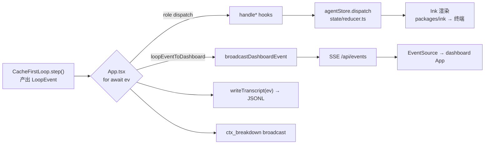
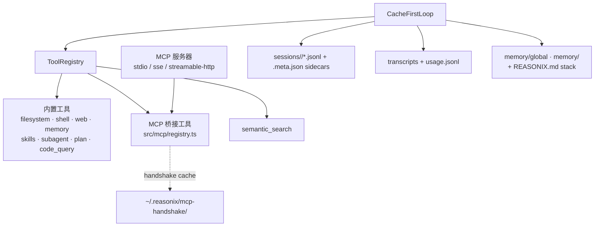

# Reasonix-Code — 流程总览

本项目的产品架构：一个 agent loop + 多个前端 + 一个发布单元（npm 包）。桌面版是薄壳，安装同一个包并加载其运行时 dashboard。

本文档补充 [`architecture.md`](architecture.md)（设计哲学 + 模块布局）。这里关注 **流程**：谁调用谁，数据流向。

---

## 1. 全域架构

Reasonix-Code 是一个 agent loop 配合多个前端（终端 TUI、浏览器 Dashboard、ACP 客户端、频道机器人），共用同一套发布单元（npm 包）。桌面应用是薄壳，安装同一个包并加载其运行时 dashboard。

```mermaid
flowchart LR
    subgraph SHIP["发布"]
        NPM["npm: reasonix-code<br/>(CLI + dashboard/dist + grammars)"]
        DESK["桌面壳<br/>Tauri · 手动构建 · build# 后缀"]
    end

    subgraph FRONT["前端（同一 loop）"]
        TUI["终端 TUI<br/>Ink (packages/ink)"]
        DASH["Dashboard<br/>Vite/React 浏览器"]
        ACPF["ACP 客户端<br/>(编辑器)"]
        CHAN["频道<br/>Telegram / Weixin / QQ"]
    end

    subgraph CORE["Agent 核心 (src/)"]
        LOOP["CacheFirstLoop<br/>src/loop.ts"]
        REPAIR["Tool-call 修复<br/>src/repair/"]
        TOOLS["ToolRegistry<br/>src/tools.ts + tools/"]
        CTX["ContextManager<br/>src/context-manager.ts"]
    end

    subgraph EXT["外部"]
        DS["DeepSeek API<br/>src/client.ts (SSE)"]
        MCP["MCP 服务器<br/>src/mcp/"]
        FS["工作区文件系统<br/>+ 代码查询 / 语义索引"]
    end

    subgraph STORE["持久化 (~/.reasonix)"]
        SESS["sessions/*.jsonl + meta"]
        TRANS["transcripts + usage.jsonl"]
        MEM["memory/ + REASONIX.md"]
    end

    NPM --> TUI
    NPM --> DASH
    DESK -. "npm install -g reasonix-code" .-> NPM
    DESK -- "spawn: reasonix-code code" --> TUI

    TUI --- LOOP
    DASH --- LOOP
    ACPF --- LOOP
    CHAN --- LOOP

    LOOP --> CTX
    LOOP --> REPAIR
    LOOP --> TOOLS
    LOOP <--> DS
    TOOLS <--> MCP
    TOOLS <--> FS
    LOOP --> SESS
    LOOP --> TRANS
    LOOP --> MEM
```

核心概念：**一个 loop，多个 sink。** `CacheFirstLoop.step()` 产出 `LoopEvent`，分发到终端（Ink）、浏览器（HTTP/SSE）、ACP、频道机器人——所有读取相同的底层存储。

---

## 2. 发布与安装流程

```mermaid
flowchart TD
    TAG["git push tag v*"] --> REL["workflow: release.yml<br/>构建 + npm 发布"]
    REL -->|publish| REG["npm registry<br/>reasonix-code"]

    MANUAL["Actions: 构建桌面版<br/>(workflow_dispatch)"] --> DWF["workflow: desktop.yml<br/>win/mac/linux 并行"]
    DWF -->|asset build# N| DREL["滚动发布<br/>desktop-latest"]

    REG --> CLI1["用户: npm i -g reasonix-code"]
    REG --> CLI2["桌面壳: npm i -g --prefix ~/.reasonix-code/npm-global reasonix-code@latest"]
    DREL --> CLI3["用户: 下载 reasonix-code-desktop-*.exe"]

    CLI1 --> RUN1["reasonix-code code ."]
    CLI3 --> RUN2["启动桌面壳"]
    RUN2 -. 自动安装/升级 .-> CLI2

    CLI1 -. "也可以" .-> RUN3["reasonix-code chat ."]
```

- **CLI 通过 npm 发布**，由 `v*` 标签触发（`.github/workflows/release.yml`）。
- **桌面版单独发布**，仅手动触发（`.github/workflows/desktop.yml`）。
- 桌面安装包约 3 MB：**仅打包启动画面**；运行时 UI 从 CLI 加载。

---

## 3. 桌面壳运行时流程

`desktop/src-tauri/src/main.rs` + `desktop/app.js`。壳的唯一工作：检测 → 安装/升级 → 启动 CLI → 在 webview 载入其 dashboard URL。

```mermaid
flowchart TD
    START["应用启动<br/>main.rs main()"] --> SETUP["setup: plugins · listen cli:url · HiDPI 限制"]
    SETUP --> SPLASH["webview: 启动画面<br/>index.html + app.js"]
    SPLASH --> CHK["check_environment<br/>node≥22? npm? find_cli?"]

    CHK -- "无 Node" --> NODE["按钮: 安装 Node.js"]
    CHK -- "无 CLI" --> ASKINSTALL["按钮: 安装 reasonix-code<br/>(用户点击)"]
    CHK -- "CLI 存在" --> VER["latest_cli_version<br/>npm view"]
    VER -- "本地 < 最新" --> ASKUP["按钮: 升级 / 继续"]
    VER -- "已是最新" --> LAUNCH

    ASKINSTALL --> INSTALL["install_cli<br/>npm i -g --prefix ~/.reasonix-code/npm-global"]
    ASKUP -- 升级 --> INSTALL
    ASKUP -- 继续 --> LAUNCH
    INSTALL -- "install:done ok" --> LAUNCH["launch_backend"]

    LAUNCH --> FIND["find_cli: REASONIX_CLI → prefix → PATH"]
    FIND --> SPAWN["spawn_tui: reasonix-code code <cwd>"]
    SPAWN --> DRAIN["读取 stdout · 扫描 stderr"]
    DRAIN --> PARSE["parse_dashboard_url"]
    PARSE --> EMIT["emit cli:url"]
    EMIT --> NAV["webview 导航 → http://127.0.0.1:PORT/dashboard"]
```

注意：
- 每个生成的进程在 Windows 上使用 `CREATE_NO_WINDOW`，安装/启动不会弹出控制台。
- 壳从不打包 dashboard；它发现 CLI 打印到 stderr 的 URL 并导航到那里。
- 升级是**用户确认**的，从不自动。

### 多工作区

每个 workspace 一个顶层 tab：

| 事件 | 用途 |
|---|---|
| `workspace-opened` | 新工作区已打开（含 workspaceDir） |
| `workspace-closed` | 工作区已关闭 |
| `cli:exit` | CLI 子进程退出（含 crashed 标志） |
| `cli:crash` | CLI 异常退出（含 reason） |

---

## 4. CLI 入口与命令分发

```mermaid
flowchart LR
    BIN["reasonix-code<br/>dist/cli/index.js"] --> BOOT["启动守卫<br/>node-version · heap · strip-bel · proxy"]
    BOOT --> CMD["commander"]
    CMD --> CODE ["code [dir]<br/>commands/code.tsx"]
    CMD --> CHAT ["chat<br/>commands/chat.tsx"]
    CMD --> RUN ["run <task><br/>commands/run.ts"]
    CMD --> ACP ["acp<br/>commands/acp.ts"]
    CMD --> UTIL["stats · sessions · replay · diff<br/>mcp · doctor · commit · update · index"]

    CODE --> TOOLSET["buildCodeToolset(rootDir)"]
    TOOLSET --> CHAT
    CHAT --> ROOT["render(<App/>)"]
    RUN --> LOOP2["new CacheFirstLoop"]
    ROOT --> APP["App.tsx 构建<br/>DeepSeekClient + ImmutablePrefix + CacheFirstLoop"]
    ACP --> LOOP3["CacheFirstLoop"]
    APP --> STEPR["for await ev of loop.step()"]
```

TUI 边界（`App.tsx`）是 loop 为交互式使用而构建的地方；`run` 和 `acp` 为 headless/bridge 使用而内联构建。

---

## 5. Agent 循环（单轮）

`CacheFirstLoop.step()` 在 `src/loop.ts` 中，基于 `src/memory/runtime.ts` 的三个缓存区域构建。

```mermaid
flowchart TD
    IN["用户输入"] --> GATE["预算门 (80/100%)"]
    GATE --> HEAL["fixToolCallPairing + reset storm"]
    HEAL --> FOLD0{"turn-start 比率<br/>> 阈值?"}
    FOLD0 -- 是 --> FOLD1["ContextManager.fold"]
    FOLD0 -- 否 --> ITER
    FOLD1 --> ITER["for iter = 0..maxIter"]

    ITER --> BUILD["buildMessages = prefix.toMessages + apiReady(log)"]
    BUILD --> CALL{"stream?"}
    CALL -- 是 --> SSE["streamModelResponse → client.stream (SSE)"]
    CALL -- 否 --> CHAT2["client.chat"]
    SSE --> PRO{"<<<NEEDS_PRO>>>?"}
    CHAT2 --> PRO
    PRO -- 是 --> ESC["本 turn 切换到 v4-pro · continue"]
    PRO -- 否 --> REPAIR
    ESC --> REPAIR["repair.process(scavenge→truncation→storm)"]
    REPAIR --> PERSIST["appendAndPersist assistant"]
    PERSIST --> CALLS{"tool calls?"}
    CALLS -- 否 --> DONE["done"]
    CALLS -- 是 --> DISPATCH["dispatchToolCallsChunked<br/>parallelSafe chunks + serial barrier"]
    DISPATCH --> AFTER["ContextManager.decideAfterUsage"]
    AFTER --> ITER
```

三个缓存区域：

| 区域 | 可变性 | 内容 | 使用者 |
|---|---|---|---|
| `ImmutablePrefix` | session 内固定 | system + sorted tool specs + few-shots | `buildMessages` |
| `AppendOnlyLog` | 追加只读（windowed + disk） | 按顺序的 assistant/tool turns | 每 session 持久化 |
| `VolatileScratch` | 每轮重置 | R1 reasoning, transient plan | 从不发送 |

---

## 6. 单循环，多 sink

```mermaid
flowchart LR
    LOOP["CacheFirstLoop.step()<br/>产出 LoopEvent"] --> FAN{"App.tsx<br/>for await ev"}

    FAN -->|role dispatch| TUIH["handle* hooks"]
    TUIH --> STORE["agentStore.dispatch<br/>state/reducer.ts"]
    STORE --> INK["Ink 渲染<br/>packages/ink → 终端"]

    FAN -->|loopEventToDashboard| BSE["broadcastDashboardEvent"]
    BSE --> SSE["SSE /api/events"]
    SSE --> BROWSER["EventSource → dashboard App"]

    FAN --> TRANS["writeTranscript(ev) → JSONL"]
    FAN --> CTXB["ctx_breakdown broadcast"]
```

Dashboard HTTP 服务器 (`src/server/index.ts`)：
- `startDashboardServer` 绑定 `127.0.0.1` 临时端口，每启动 token。
- 路由：`/`, `/assets/*`, `/api/events` (SSE), `/api/*`。

---

## 7. 整合与持久化

```mermaid
flowchart TD
    LOOP["CacheFirstLoop"] --> TOOLS["ToolRegistry"]
    TOOLS --> BUILTIN["内置工具<br/>filesystem · shell · web · memory<br/>skills · subagent · plan · code_query"]
    TOOLS --> MCPT["MCP 桥接工具<br/>src/mcp/registry.ts"]
    TOOLS --> SEM["semantic_search"]

    MCP["MCP 服务器<br/>stdio / sse / streamable-http"] --> MCPT
    MCPT -. handshake cache .-> MCPHC["~/.reasonix/mcp-handshake/"]

    LOOP --> SESS["sessions/<slug>/*.jsonl + .meta.json sidecars"]
    LOOP --> TR["transcripts + usage.jsonl"]
    LOOP --> MEM["memory/global · memory/<project><br/>+ REASONIX.md stack"]
```

---

## 8. Dashboard HTTP API — 完整清单

由 `src/server/index.ts` 在 `127.0.0.1:<ephemeral>` 上提供，token-gated。

**Session / turn**

| 端点 | 方法 | 用途 |
|---|---|---|
| `/api/overview` | GET | 捆绑快照 |
| `/api/messages` | GET | 当前 session transcript + `busy` |
| `/api/submit` | POST | 提交 prompt 到 loop |
| `/api/abort` | POST | 中止当前 turn |
| `/api/sessions` | GET | 列出 sessions |
| `/api/sessions/new` | POST | 建立新 session |
| `/api/events` | GET (SSE) | DashboardEvent stream |

**Tools / permissions / hooks**

| 端点 | 方法 | 用途 |
|---|---|---|
| `/api/tools` | GET | 已注册 tool specs |
| `/api/permissions` | GET, POST, DELETE | shell allowlist 管理 |
| `/api/hooks` | GET | hooks + recentRuns |

**Memory / skills / MCP / semantic**

| 端点 | 方法 | 用途 |
|---|---|---|
| `/api/memory` | GET | 列出记忆档 |
| `/api/memory/entries` | GET | 结构化条目 |
| `/api/skills` | GET | 列出技能 |
| `/api/mcp` | GET | 已桥接服务器 |
| `/api/mcp/registry` | GET | marketplace 浏览 |
| `/api/semantic` | GET | 索引 + 供应商 + job 状态 |

**Code / files / checkpoints**

| 端点 | 方法 | 用途 |
|---|---|---|
| `/api/files` | POST | @-mention picker |
| `/api/browse?path=` | GET | 目录浏览器 |
| `/api/project-tree` | GET | 递归树 |
| `/api/git-diffs` | GET | `git diff HEAD` |
| `/api/file/:path` | GET | 读取工作区文件 |
| `/api/checkpoints` | GET | 列出 checkpoints |

---

## 9. 速查索引

| 关注点 | 路径 |
|---|---|
| Agent loop | `src/loop.ts`, `src/loop/` |
| 缓存区域 | `src/memory/runtime.ts` |
| 修复管线 | `src/repair/` |
| 工具 | `src/tools.ts`, `src/tools/`, `src/code/setup.ts` |
| DeepSeek client | `src/client.ts` |
| TUI | `packages/ink`, `src/cli/ui/` |
| Dashboard | `dashboard/` |
| Desktop shell | `desktop/src-tauri/src/main.rs` |
| MCP / ACP | `src/mcp/`, `src/acp/` |
| 代码智能 | `src/code-query/`, `src/index/semantic/` |
| 持久化 | `src/memory/`, `src/transcript/`, `src/telemetry/` |
| 频道 | `src/telegram/`, `src/weixin/`, `src/qq/` |
| 发布 | `.github/workflows/release.yml` |
| 桌面发布 | `.github/workflows/desktop.yml` |
